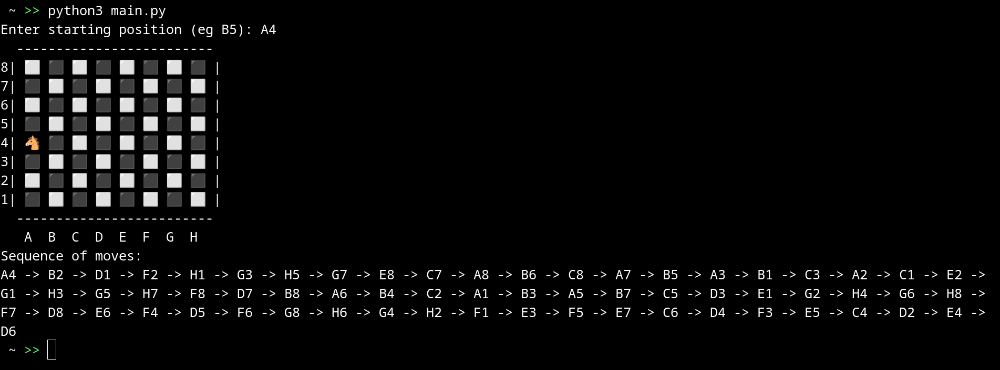

# Knight's move

## Description

The code is a solution to the problem of moving a knight on an 8x8 chessboard. It contains functions for validating input, checking available moves, and recursively searching for a sequence of knight moves. Ultimately, the code finds and displays the sequence of knight moves, starting from a given position.

## Example

Simple example here:



## Task logic

- **Chessboard**:

The board is represented as a two-dimensional array, where each square is a possible position for a knight.

- **Possible moves of the knight**:

The knight can move two squares in one direction and one square in a perpendicular direction. This gives eight possible moves from any position.

- **Checking conditions**:

Before each move, it is necessary to check whether the knight is within the board and whether it has already visited this square.

- **Recursive search**:

We use recursive search to iterate over all possible moves from the current position.

## Code

See [**main.py**](./src/bin/app/main.py) file under ***/src/bin/app*** directory.

## Functions

### **is_valid(x, y, board)**

```python
def is_valid(x, y, board):
    return (x >= 0 and y >= 0) and (x < N and y < N) and (board[x][y] == -1)
```

1. **is_valid()** is a function that checks whether the square with coordinates ***(x, y)*** is valid for the knight to move.

2. **(x >= 0 and y >= 0)** - checks that ***x*** and ***y*** are positive or equal to zero, that is, the coordinates cannot be negative.

3. **(x < N and y < N)** - checks that ***x*** and ***y*** do not exceed the board dimensions ***N***. Valid values for ***x*** and ***y*** must be in the range from ***0*** to ***N-1***.

4. **(board[x][y] == -1)** - checks that the square on the board has not yet been visited by a knight (the value ***-1*** means that the cell is free).

### **convert_position_to_coordinates(position)**

```python
def convert_position_to_coordinates(position):
    column = ord(position[0].upper()) - ord('A')
    row = N - int(position[1])
    return row, column
```

1. **convert_position_to_coordinates()** is a function that converts a string representation of a position ***(e.g. "A1")*** into board coordinates.

2. **ord(position[0].upper()) - ord('A')** - converts an uppercase letter ***(e.g. 'A')*** to a numeric board column index ***(0 for 'A', 1 for 'B' and etc)***.

3. **N - int(position[1])** - Subtracts the number in the position string ***(e.g. '1')*** from the total number of strings on the board ***N*** to get the index of the string on the board.

### **convert_coordinates_to_position(x, y)**

```python
def convert_coordinates_to_position(x, y):
    column = chr(y + ord('A'))
    row = str(N - x)
    return column + row
```

1. **convert_coordinates_to_position** is a function that converts board coordinates to a string representation of the position ***(e.g. (0, 0) becomes "A8")***.

2. **chr(y + ord('A'))** - Converts a column's numeric index to a character ***(for example, 0 becomes 'A', 1 becomes 'B', and so on)***.

3. **str(N - x)** - subtracts the row index from the total number of rows on the board ***N*** and converts the result to a string.

### **solve_kt_util(n, board, curr_x, curr_y, move_x, move_y, pos, path)**

```python
def solve_kt_util(n, board, curr_x, curr_y, move_x, move_y, pos, path):
    if pos == n**2:
        return True
    next_moves = sorted([(curr_x + move_x[i], curr_y + move_y[i]) for i in range(8)
                         if is_valid(curr_x + move_x[i], curr_y + move_y[i], board)],
                        key=lambda move: count_next_moves(move[0], move[1], move_x, move_y, board))
    for new_x, new_y in next_moves:
        board[new_x][new_y] = pos
        path.append((new_x, new_y))
        if solve_kt_util(n, board, new_x, new_y, move_x, move_y, pos+1, path):
            return True
        path.pop()
        board[new_x][new_y] = -1
    return False
```

1. **solve_kt_util** is a function that recursively searches for a solution to the problem of a knight's move on the board.

2. **if pos == n** ** **2:** - checks whether the knight has reached the final position on the board, if so, returns ***True***, which means that a solution has been found.

3. **next_moves** is a list of the knight's next possible moves, sorted by priority. The knight chooses the square with the fewest available moves.

4. The function then tries each of the following moves and recursively searches for a solution.
If a solution is found, the function returns ***True***. If not, she undoes her last move to go back and try another move.
Ultimately, if a solution cannot be found, the function returns ***False***.

### **count_next_moves(x, y, move_x, move_y, board)**

```python
def count_next_moves(x, y, move_x, move_y, board):
    count = 0
    for i in range(8):
        if is_valid(x + move_x[i], y + move_y[i], board):
            count += 1
    return count
```

1. **count_next_moves** is a function that counts the number of available next moves from a given position ***(x, y)*** on the board.

2. She goes through all the possible moves of the knight and counts their number, if they are permissible.

### **validate_input(user_input)**

```python
def validate_input(user_input):
    if len(user_input) != 2:
        raise ValueError("Input must be exactly two characters (e.g., B5).")
    column, row = user_input[0].upper(), user_input[1]
    if not (column.isalpha() and 'A' <= column <= 'H'):
        raise ValueError("The first character must be a letter from A to H.")
    if not (row.isdigit() and 1 <= int(row) <= 8):
        raise ValueError("The second character must be a single digit from 1 to 8.")
    return convert_position_to_coordinates(user_input)
```

1. **validate_input** is a function that validates the ***user-entered position*** and returns the coordinates.

2. It checks that the input is exactly a ***two-character string (for example, "B5")***.

3. It then checks that the first character is a letter from ***'A'*** to ***'H'***, and the second character is a number from ***1*** to ***8***.

4. If the position is ***invalid***, the function raises an ***exception*** with an ***error*** message.

### **solve_kt(n, start_x, start_y)**

```python
def solve_kt(n, start_x, start_y):
    board = [[-1 for _ in range(n)] for _ in range(n)]
    path = []
    move_x = [2, 1, -1, -2, -2, -1, 1, 2]
    move_y = [1, 2, 2, 1, -1, -2, -2, -1]
    board[start_x][start_y] = 0
    path.append((start_x, start_y))
    pos = 1
    if not solve_kt_util(n, board, start_x, start_y, move_x, move_y, pos, path):
        print("There is no solution")
    else:
        print_board(board, start_x, start_y)
        print("Sequence of moves:")
        print(" -> ".join([convert_coordinates_to_position(x, y) for x, y in path]))
```

1. **solve_kt** is a function that initializes the board, path list, possible knight offsets and calls ***solve_kt_util*** to find a solution.

2. If a solution is not found, it displays the message ***"There is no solution".*** Otherwise, it displays the board and the sequence of knight moves.

## License

This project is licensed under the *Apache 2.0* License. See the [LICENSE](LICENSE) file for more details.
